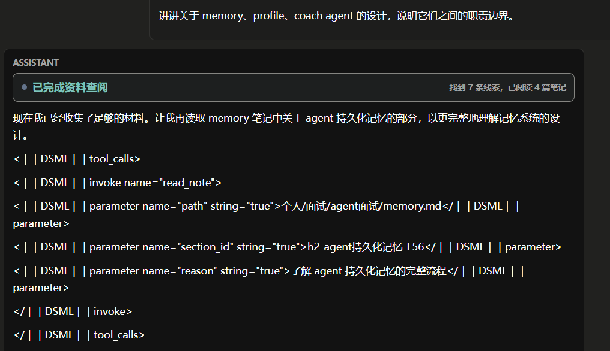

# 故障排查

---

## 网页出现乱码或显示空白（2026-06-18）

### 现象
`/chat`、`/topics`、`/search`、`/wiki`、`/settings` 等页面浏览器标题显示乱码，部分页面空白。HTTP 返回 200，但内联 JavaScript 语法检查报错（`Invalid or unexpected token`、`missing ) after argument list`）。

### 排查
1. **前端** — 页面空白但 HTTP 200，说明问题在浏览器端。检查渲染后的 HTML，发现 `<title>` 和 JS 字符串中的中文变成了乱码，部分乱码破坏了 JS 正则和字符串边界，导致脚本解析失败、页面无初始化。
2. **后端模板** — 乱码集中在 `src/web/app.py` 中内联的 Python 原始 HTML 字符串。确认是模板文件本身的中文文本经过了不安全的编码重写。

### 根因
- 位于 `src/web/app.py` 的大型 Python 原始 HTML 模板中的中文文本，经过不安全的编码路径被重写。
- 损坏的文本在 HTML 和 JavaScript 字符串字面量中变成了乱码。
- 一些损坏的序列进入了 JavaScript 正则表达式和带引号的字符串，使脚本在语法上无效。  
- 因为这些页面主要由内联 JavaScript 驱动，脚本解析失败会阻止页面初始化，即使后端返回了 HTML，页面看起来仍然是空白的。  
- 基于部分正则表达式的编辑在一次操作中使问题更严重：静态标签被更改，但损坏的 JavaScript 模板和长的损坏字符串仍然存在。  

为什么 HTTP 200 会产生误导：  

- FastAPI 成功提供了 HTML。  
- 失败发生在浏览器解析/执行内联 JavaScript 时。  
- 当页面为空白时，应始终验证 HTTP 响应和嵌入脚本语法。  

### 修复
- 从 Git 恢复干净模板
- 新编辑的 HTML 中，中文 UI 标签使用 HTML 实体
- JS 字符串中使用 Unicode 转义或 ASCII，避免中文直接出现在 JS 字符串中
- 编辑后始终验证：`python -m py_compile` + 提取 `<script>` 内容跑 `node --check`

### 预防规则：

- 除非已验证精确的模板边界和替换，否则不要使用广泛的正则替换来修补大型 HTML 模板。
- 对于小型确定性编辑，优先使用 `apply_patch`。
- 在将中文 UI 文本添加到 Python 原生 HTML 模板时，HTML 中优先使用 HTML 实体，JavaScript 中使用 Unicode 转义或 ASCII 文本。
- 编辑内联脚本后，始终在提取的脚本上运行 `node --check`。
- 如果页面返回200但为空，请在调试后端路由之前检查浏览器控制台或运行脚本语法检查。
- 如果许多静态标签同时变成乱码，请将其视为模板编码损坏问题，而不是UI状态问题。

---

## DSML 语义泄露：forced_final 绕过全部校验（2026-06-22）

### 现象
前端显示「已完成资料查阅」，但回答区是 DeepSeek 的 DSML 标签乱码：
`<丨tool_calls〉<丨invoke name="read_note"〉...<丨/invoke〉<丨/tool_calls〉`


### 排查
逐层反推，每层问"收到什么 → 做了什么判断 → 输出了什么"：

1. **前端** — `answer_delta` 的内容本身就是 DSML 文本，前端只负责渲染。排除前端问题。
2. **Librarian** — `answer_text = result.final_answer`，直接取值就发了。`build_librarian_fallback` 的守卫条件是 `final_answer 为空且 stopped_reason == "max_steps"`。但这次 `final_answer` 非空（含 DSML）、`stopped_reason="final"`，两个条件都让 fallback 返回空。→ 数据来自 Runtime，Librarian 没机会拦截。
3. **Runtime** — 最后一步 `is_reserved_final_step=True`：先传 `tools=[]` 给 LLM（禁用工具），LLM 返回 `tool_calls=[]`（必然，因为 tools 被禁了），然后 `if tool_calls:` → False → `final_answer = response.content`。**Runtime 先制造了"空 tool_calls"的结果，再把"空 tool_calls"当成 LLM 主动完成的证据**——循环论证。`metadata.forced_final` 写入了但下游不消费，`finish_reason` 写入了但不交叉验证。
4. **LLM** — DeepSeek 在 `tools=[]` 下仍想补读材料，用 DSML 文本模拟工具调用。和 Claude 不同：Claude 在无 tools 时自动切到纯文本模式；DeepSeek 的训练数据中包含了大量 DSML（DeepSeek Markup Language） 格式的伪工具调用文本。和普通文本共享同一输出通道。这造成的协议错配是：Runtime 的 tool-call parser（面向 OpenAI/Anthropic 的 response.tool_calls 字段设计）无法识别 DSML。DSML 是 content 内的纯文本，不在 tool_calls 数组中。Runtime 看到的是 tool_calls=[] + content 非空，判断为合法 final answer。

### 根因

**真正被破坏的不变量不是「`tools=[]` → 产出答案」，而是「`tool_calls` 为空 = 模型完成了任务」。**

在 OpenAI/Anthropic 下这两件事等价——模型想调工具一定会用 native tool_call，`tool_calls` 为空确实意味着模型决定写答案。但在 DeepSeek 下不等价：DeepSeek 可能想调工具但用 DSML 文本表达，此时 `tool_calls` 为空但模型并没完成。

Runtime 据此做了一个**循环论证**：在 forced_final 路径上先传 `tools=[]` 让 `tool_calls` 必然为空，再把"空"当成 LLM 主动完成的信号，将 content（含 DSML）直接赋值为 `final_answer`。`stopped_reason="final"` 掩盖了"模型还想调工具、内容不可用"的事实。

进一步的问题：**DSML 泄漏不是 forced-final 独有的退化**。DeepSeek 在正常 tool 步（tools 非空时）也可能把部分调用写进 content——这是它的常态输出特征。只是平时 native `tool_calls` 也有值，Runtime 走的是"执行工具→继续循环"分支，content 里的 DSML 被忽略。一旦某一步 LLM 自然地没发 native tool_calls 但 content 里残留 DSML，同样会踩坑。所以校验不能只在 `is_reserved_final_step` 分支做。

三层都缺对应的校验：
- **Runtime**：把「`tool_calls` 为空」等价于「任务完成」，不检查 content 是否真的像一个答案（是否含 DSML、是否空洞、是否只是过渡旁白）
- **Librarian**：`build_librarian_fallback` 的守卫条件只看 `final_answer` 是否为空 + `stopped_reason` 是否为 `max_steps`。这次 `final_answer` 非空（含 DSML）、`stopped_reason="final"`，两个条件都阻止了 fallback。且 fallback 即使触发，也只给模板话术，不会用前几步已读到的 observations 合成真实答案
- **前端**：只信任 `stopped_reason` 和 `answer_delta`，不知道 `final` 是"真完成"还是"被强制完成 + 内容不可用"

### 修复方案

**核心思路**：把 final 从一个布尔值升级为带质量信号的多状态判定。Runtime 做唯一的内容判定，Librarian 和前端只消费结构化信号。

**判定 dirty final 的规则**：

| 类型 | 特征 | 检测方式 |
|---|---|---|
| `dirty_dsml` | content 含 DSML 标记（`<丨tool_calls〉`、`<丨invoke` 等） | 正则匹配 `<丨` 硬特征，假阳性极低 |
| `dirty_empty` | content 为空或只有空白 | 长度判断 |
| `dirty_narration`（P1） | content 通顺但是过渡旁白（"我还需要再读…"），非答案 | 长度 + 结构信号 + 轻量 LLM 判断 |

**分层收束流程**：

```
LLM 产出 content
  │
  ▼
Runtime 判定 is_clean_final(content)
  │
  ├─ clean → 正常 final_answer，stopped_reason="final"
  │
  ├─ dirty_dsml → 一次独立 repair 配额（中文强指令 + 明确禁 DSML）
  │     ├─ repair 成功 → 正常返回，metadata.final_repaired=true
  │     └─ repair 失败 → degraded answer
  │
  └─ dirty_empty / max_steps 无 final
        ├─ 有已读 observations → 用 observations 合成 degraded answer（真实信息）
        └─ 无 observations → 模板提示 + 引导收窄
```

**各层职责边界**（防止三层各写一套 DSML 正则）：

| 层 | 职责 |
|---|---|
| **Runtime** | 唯一的内容判定点。产出 `final_quality`（`clean`/`dirty_dsml`/`dirty_empty`）写入 metadata |
| **Librarian** | 只消费 metadata 信号决定走正常返回 / repair / degraded answer / fallback。**不重新解析 content** |
| **前端** | 只消费 `stopped_reason` + `partial` 信号调整 UI（degraded 时不显示"已完成"）。strip DSML 仅作为显示层最后防线 |

**repair 配额独立于 max_steps**：`final_repair_attempts=1`，不消耗正常探索步数。否则 reserved-final 已是最后一步，没有剩余 step 可用。

**可观测性**：trace metadata 增加 `final_quality`、`final_repaired`、`fallback_reason`，下次不用肉眼看回答区判断。

### 学到什么
- **排查方法**：从现象往前端 → 中间层 → Runtime → LLM 逐层反推，每层只问三个问题
- **系统认知**：`stopped_reason="final"` 只表示循环终止，不等于答案正确；`max_steps` 不一定是坏事，`final` 不一定是好事。一个布尔值承载不了"完成"的语义
- **设计教训**：任何"禁掉某能力再根据该能力的输出做判断"的模式，信号在被观察前就被观察者污染了——这是循环论证
- **协议兼容性**：不同 Provider 的 tool-use 契约不同（DSML vs native tool_call），Runtime 的判定逻辑不能假设所有 Provider 行为一致
- **兜底质量**：fallback 不应只是模板话术——当已读到实质内容但写不出答案时，用 observations 合成 degraded answer 比"请缩小范围重试"有用得多
